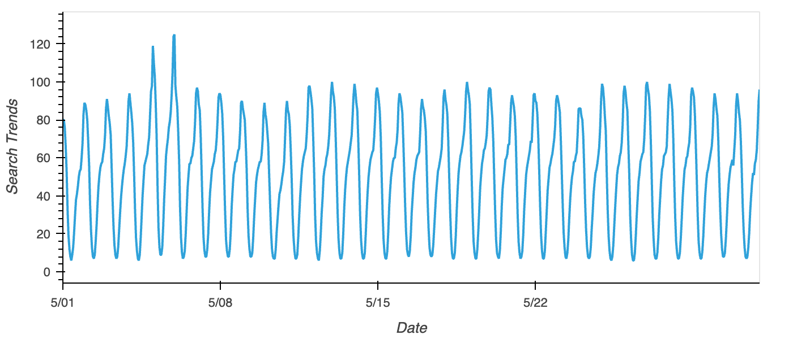

# Forecasting Net Prophet

## Find Unusual Patterns in Hourly Google Search Traffic

The following figure shows the hourly google search trends of MercadoLibre for the month of May 2020.

Search traffic for the month of May 2020 is 38181 when MercadoLibre released its financial results. Overall monthly median value is 35172.5. The search traffic for the month of May 2020 is 8.55% higher than the overall monthly median value.

## Mine the Search Traffic Data for Seasonality

This plot shows search trends as a function of day of week:

This plot shows heat map for day of week vs hour of day:

In general, the week days have higher search traffic than the weekends. The highest search traffic occurs around middle night (10pm-2am).

This plot shows the search trends as a function of the week of the year.

The search traffic tends to increase during the winter holiday period.

## Relate the Search Traffic to Stock Price Patterns

There are the correlations between stock volatility, lagged search trends and hourly stock return:

|              |Stock Volatility|Lagged Search Trends|Hourly Stock Return|
|--------------------|----------------|--------------------|-------------------|
|Stock Volatility    |1               |-0.148938           |0.061424           |
|Lagged Search Trends|-0.148938       |1                   |0.01812            |
|Hourly Stock Return |0.061424        |0.01812             |1                  |

There is a mild negative correlation between the lagged search traffic and the stock volatility, which means more search traffic leads to less stock volatility. There is a small positive correlation between the lagged search traffic and the stock price return, which means more search traffic leads to more stock price return.

## Create a Time Series Model with Prophet

This is the Prophet predictions for the Mercado trends data:

The popularity of MercadoLibre is predicted to decrease and then increase in the near term.

Here are the forecast results:

Midnight exhibits the greatest popularity. Tuesday gets the most search traffic. Sept 20 is the lowest point for search traffic in the calendar year. 